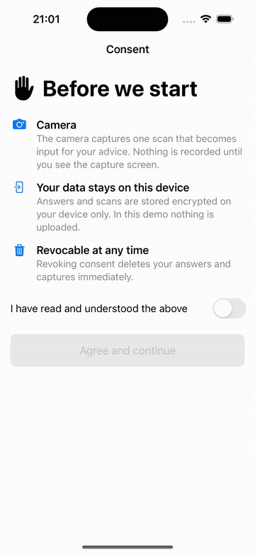
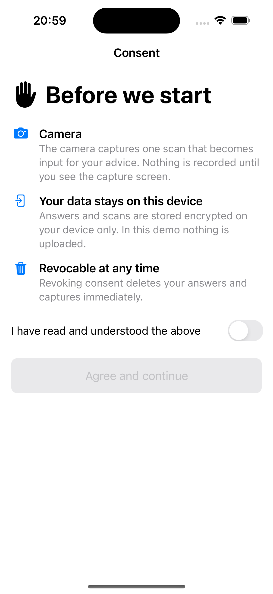
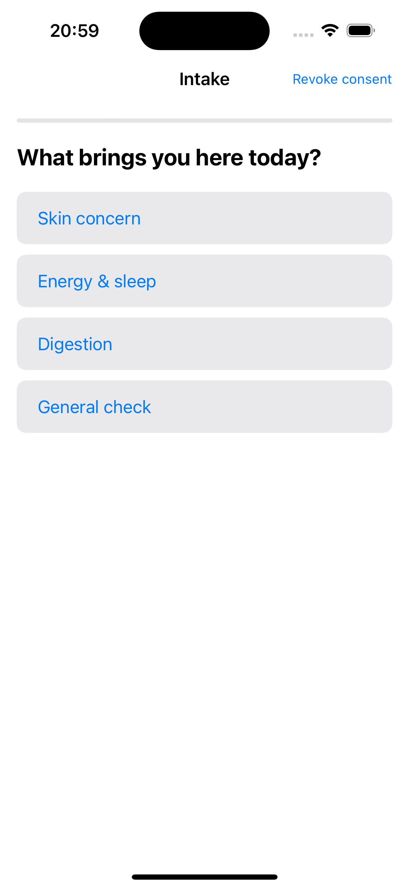
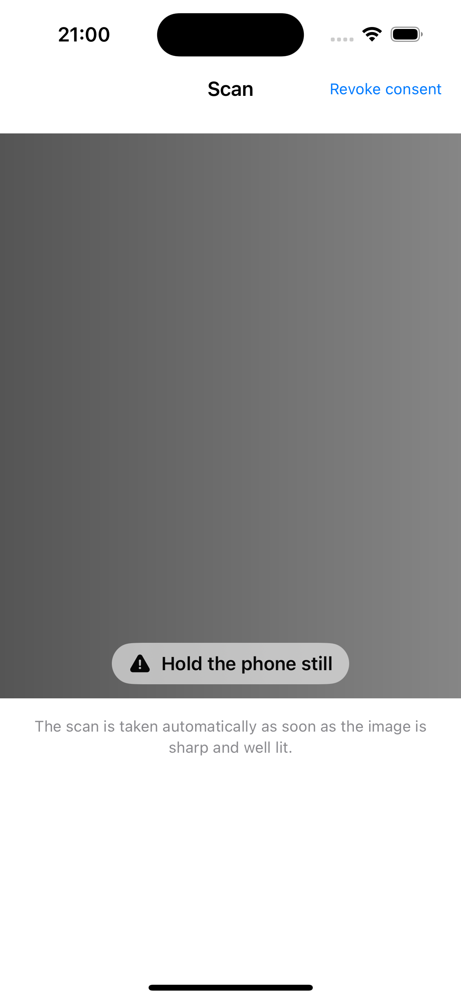
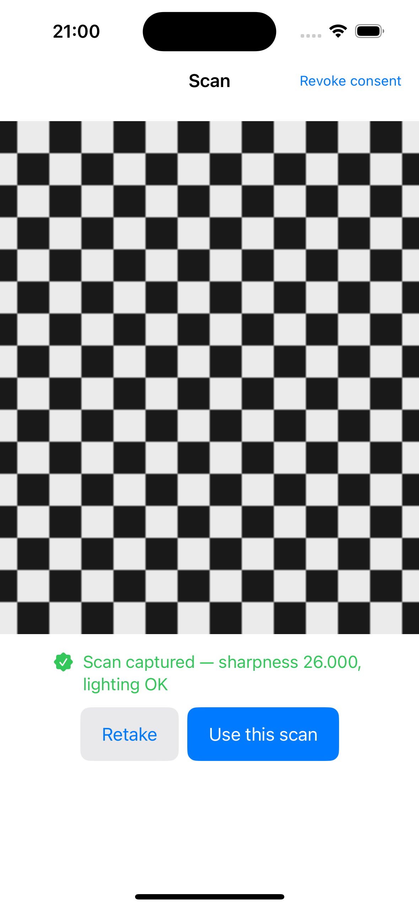
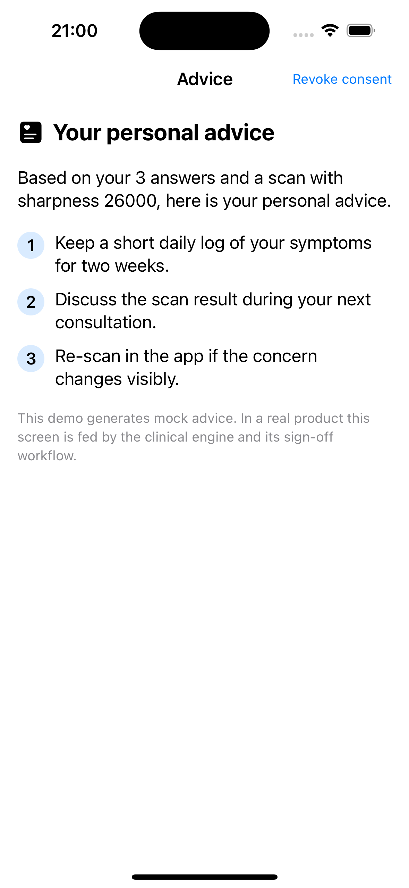

# Health Intake Pipeline


A case-study iOS app: a health intake flow that turns an **anamnesis + camera
scan into personal advice** — built the way a regulated digital-health product
demands it. Native SwiftUI, no third-party dependencies.

> Built as a portfolio piece around a typical digital-health mobile vacancy.
> All medical content is mock; the engineering is real.

**Demo flow:** consent → short intake → camera scan that only accepts a sharp,
well-lit frame → advice that is shown **only after clinical sign-off**.

<p align="center">
  
</p>

| Consent | Intake | Guidance | Captured | Advice |
|---|---|---|---|---|
|  |  |  |  |  |

## Why these five modules

| Requirement in a digital-health app | Where it lives here |
|---|---|
| Reliable camera capture that feeds a vision pipeline usable input | `App/CameraScan` — AVFoundation session + variance-of-Laplacian sharpness and exposure scoring, auto-capture only after stable quality |
| API integration, state management, async work | `App/Engine/APIClient.swift` — async/await, retry with exponential backoff |
| Offline behavior and caching | `App/Engine/OfflineQueue.swift` + `AdviceCache.swift` — persisted, deduplicated queue; encrypted, purge-safe cache |
| Advice goes live only after clinical sign-off | `App/ClinicalGate/SignOffGate.swift` — the rule enforced by the type system, not by convention |
| Privacy by design, consent, GDPR | `App/Consent` + [docs/privacy-by-design.md](docs/privacy-by-design.md) — versioned, revocable consent; data minimization; encryption at rest |
| Tested, readable code + CI | `Tests/` + `UITests/` + [`.github/workflows/ci.yml`](.github/workflows/ci.yml) — unit tests on the analyzer, engine, queue and gate, plus an end-to-end XCUITest of the full journey, run on every push |
| Accessibility | applied in every view, rationale in [docs/accessibility.md](docs/accessibility.md) |

## The interesting part: quality-gated capture

The camera never hands a bad frame to the pipeline. Every preview frame is
downscaled and scored on three independent gates — variance-of-Laplacian for
sharpness, mean luminance for exposure, and Vision face detection for subject
framing — and the user gets one actionable instruction at a time ("Hold the
phone still", "Center your face", "Find more light"). Capture happens automatically only after
**three consecutive** usable frames: one lucky sharp frame is not evidence of
a steady shot. The accepted image travels with its quality report, so the
downstream pipeline can audit what it received.

The analyzer is a pure function `CGImage → CaptureQuality`, tested with
synthetic checkerboard (sharp) and gradient (blurred) frames — the same
frames the simulator mode replays, so the full guidance → auto-capture journey
runs without camera hardware.

## Run it

```bash
brew install xcodegen   # once
xcodegen generate
open HealthIntake.xcodeproj
```

Run the `HealthIntake` scheme. On a device you get the live camera; in the
simulator a synthetic frame source replays the blurry → sharp journey so every
screen is reachable. Tests: `⌘U`, or exactly what CI runs:

```bash
xcodebuild test -project HealthIntake.xcodeproj -scheme HealthIntake \
  -destination 'platform=iOS Simulator,name=iPhone 16' CODE_SIGNING_ALLOWED=NO
```

## Design notes

- [docs/architecture.md](docs/architecture.md) — state, caching and offline
  policy, and why the sign-off gate is a type.
- [docs/privacy-by-design.md](docs/privacy-by-design.md) — consent versioning,
  data minimization, encryption at rest.
- [docs/accessibility.md](docs/accessibility.md) — what is applied per screen
  and why.

## Deliberate scope

No third-party dependencies, no backend, no half-built features. Things a
production version adds — a real engine API, sign-off workflow tooling,
localization, analytics with consent — are documented where they would go
rather than mocked badly.

---

*Philippe Godfroy — iOS apps in production: ReflectBuddy (App Store),
MirrorMate (Mac App Store).*
