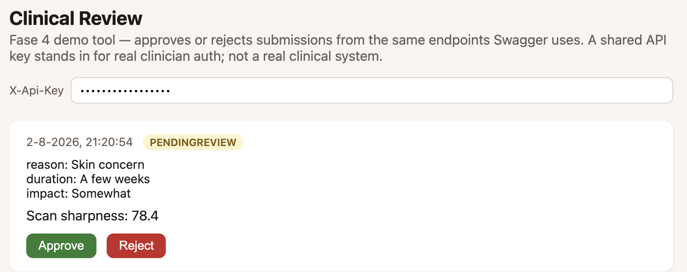

<p align="center">
  
</p>

<h1 align="center">Health Intake Pipeline</h1>

<p align="center">
  <a href="https://github.com/phlppgdfry/health-intake-pipeline/actions/workflows/ci.yml"></a>
  <a href="https://github.com/phlppgdfry/health-intake-pipeline/actions/workflows/backend-ci.yml"></a>
  
  
  
  
  
  <a href="LICENSE"></a>
</p>

A case-study iOS app: a health intake flow that turns an **anamnesis + camera
scan into personal advice** — built the way a regulated digital-health product
demands it. Native SwiftUI, no third-party dependencies.

> Built as a portfolio piece around a typical digital-health mobile vacancy.
> All medical content is mock; the engineering is real.

**Demo flow:** consent → short intake → camera scan that only accepts a sharp,
well-lit frame → advice that is shown **only after clinical sign-off**.

<p align="center">
  
</p>

| Consent | Intake | Guidance | Captured | Advice |
|---|---|---|---|---|
|  |  |  |  |  |

On the other side of that "clinical sign-off": the clinician review page
(`Backend/`, fase 4) a submission actually waits on —

<p align="center">
  
</p>

## Why these five modules

| Requirement in a digital-health app | Where it lives here |
|---|---|
| Reliable camera capture that feeds a vision pipeline usable input | `App/CameraScan` — AVFoundation session + variance-of-Laplacian sharpness and exposure scoring, auto-capture only after stable quality |
| API integration, state management, async work | `App/Engine/RemoteAdviceAPI.swift` — async/await, retry with exponential backoff, idempotency keys, talks to the real backend in [`Backend/`](Backend/README.md) (opt-in via `API_BASE_URL`; `MockAdviceAPI` stays the CI default) |
| Reliable offline sync | `App/Engine/OfflineQueue.swift` — persisted, deduplicated, per-item attempt tracking (a stuck item can't block the rest); auto-flushes on reconnect via `ConnectivityMonitor`; idempotency keys mean a replayed submission can never duplicate server-side. `App/Intake/IntakeDraftStore.swift` persists in-progress answers so a killed app resumes instead of restarting. |
| Advice goes live only after clinical sign-off | `App/ClinicalGate/SignOffGate.swift` client-side **and** the backend's `IntakeSubmissionsController` server-side — content is `null` in the API response until `Approved`, reviewable via a small [clinician page](Backend/README.md#run-it) protected by an API key (`ApiKeyAuthFilter`) |
| Defending the API boundary | `Idempotency-Key` (dedup), `[MinLength]`/`[Range]` model validation with automatic 400s, `ApiKeyAuthFilter` on the clinician-only endpoints, `/health` for orchestration probes, structured logging (Serilog) that never logs answer content — see [`Backend/README.md`](Backend/README.md#security-fase-5) |
| Privacy by design, consent, GDPR | `App/Consent` + [docs/privacy-by-design.md](docs/privacy-by-design.md) — versioned, revocable consent; data minimization; encryption at rest |
| Tested, readable code + CI + monitoring | iOS: `Tests/` + `UITests/` + [`.github/workflows/ci.yml`](.github/workflows/ci.yml) — unit tests plus an end-to-end XCUITest, on every push; privacy-redacted `os.Logger` events (`Engine/Logging.swift`). Backend: `Backend/HealthIntake.Api.Tests/` + [`.github/workflows/backend-ci.yml`](.github/workflows/backend-ci.yml) — build, format check, tests against real PostgreSQL, coverage, Docker build. |
| Accessibility | applied in every view, rationale in [docs/accessibility.md](docs/accessibility.md) |

## The interesting part: quality-gated capture

The camera never hands a bad frame to the pipeline. Every preview frame is
downscaled and scored on three independent gates — variance-of-Laplacian for
sharpness, mean luminance for exposure, and Vision face detection for subject
framing — and the user gets one actionable instruction at a time ("Hold the
phone still", "Center your face", "Find more light"). Capture happens automatically only after
**three consecutive** usable frames: one lucky sharp frame is not evidence of
a steady shot. The accepted image travels with its quality report, so the
downstream pipeline can audit what it received.

The analyzer is a pure function `CGImage → CaptureQuality`, tested with
synthetic checkerboard (sharp) and gradient (blurred) frames — the same
frames the simulator mode replays, so the full guidance → auto-capture journey
runs without camera hardware.

## Run it

```bash
brew install xcodegen   # once
xcodegen generate
open HealthIntake.xcodeproj
```

Run the `HealthIntake` scheme. On a device you get the live camera; in the
simulator a synthetic frame source replays the blurry → sharp journey so every
screen is reachable. Tests: `⌘U`, or exactly what CI runs:

```bash
xcodebuild test -project HealthIntake.xcodeproj -scheme HealthIntake \
  -destination 'platform=iOS Simulator,name=iPhone 16' CODE_SIGNING_ALLOWED=NO
```

By default the app talks to `MockAdviceAPI` (so the above needs nothing
else). To run it against the real backend instead, see
[`Backend/README.md`](Backend/README.md) — `docker compose up` there starts
Postgres *and* the API — then enable `API_BASE_URL` in the `HealthIntake`
scheme's environment variables.

## Design notes

- [docs/architecture.md](docs/architecture.md) — state, caching and offline
  policy, and why the sign-off gate is a type.
- [docs/privacy-by-design.md](docs/privacy-by-design.md) — consent versioning,
  data minimization, encryption at rest.
- [docs/accessibility.md](docs/accessibility.md) — what is applied per screen
  and why.

## Deliberate scope

No third-party iOS dependencies, no half-built features. The backend
(`Backend/`) is real — ASP.NET Core + PostgreSQL, idempotent submissions, an
API-key-gated clinician review flow, Docker + CI — not mocked. What a
production version still adds on top — per-clinician identity instead of a
shared API key, push instead of polling, localization, analytics with
consent — is documented where it would go rather than mocked badly.

---

*Philippe Godfroy — iOS apps in production: ReflectBuddy (App Store),
MirrorMate (Mac App Store).*
