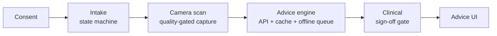

# Architecture

The app is a linear, consent-gated pipeline. Each stage owns one concern and
hands a typed result to the next.

## State

- `AppFlow` (ObservableObject) is the single source of truth for the journey
  step and the data collected so far. Views never navigate directly; they
  advance the flow, and `RootView` renders whatever step the flow is in.
- Each screen has its own view model (`IntakeViewModel`, `ScanViewModel`) for
  screen-local state, so screen logic is unit-testable without SwiftUI.

## Camera scan

- `FrameSource` abstracts the frame stream. `LiveCameraService` implements it
  with AVFoundation (session lifecycle off the main thread, frames throttled
  to ~5 fps for analysis); `SimulatedCameraService` implements it with
  synthetic frames so simulator, previews and tests run the identical flow.
- `FrameQualityAnalyzer` is a pure function `CGImage → CaptureQuality`:
  variance-of-Laplacian for sharpness, mean luminance for exposure. Because it
  has no camera dependency it is tested directly with synthetic images.
- `FaceFramingChecker` adds a third, independent gate for live capture: Vision
  face detection turned into the same actionable-verdict shape (no subject /
  too far / off-center). Sources declare via `requiresSubjectFraming` whether
  the gate applies — the live camera does, synthetic test cards don't.
- `ScanViewModel` auto-captures only after several consecutive usable frames —
  one lucky sharp frame is not evidence the user is holding a good shot.

## Engine: caching and offline behavior

`AdviceEngine` applies one explicit policy:

1. **Cache hit** → serve immediately. An advice, once given, stays available
   offline (stored in Application Support, not Caches, so the OS won't purge it).
2. **Online** → request through `RetryingAdviceAPI` (exponential backoff on
   transient errors), then cache.
3. **Offline** → persist the request in `OfflineQueue` (deduplicated on cache
   key) and tell the UI honestly that it is queued. When connectivity returns,
   `flushOfflineQueue()` replays oldest-first and stops at the first failure.

Connectivity is injected as a closure, so every branch of the policy is
unit-tested without network conditions.

## Clinical sign-off gate

`SignOffGate` turns the rule "advice goes live only after clinical sign-off"
into the type system: the UI can only render `ReleasedAdvice`, and its
initializer is `fileprivate` to the gate. There is no code path that shows
unapproved advice — not by discipline, but by construction.
