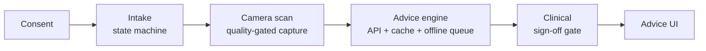

# Architecture

The app is a linear, consent-gated pipeline. Each stage owns one concern and
hands a typed result to the next.

## State

- `AppFlow` (ObservableObject) is the single source of truth for the journey
  step and the data collected so far. Views never navigate directly; they
  advance the flow, and `RootView` renders whatever step the flow is in.
- Each screen has its own view model (`IntakeViewModel`, `ScanViewModel`) for
  screen-local state, so screen logic is unit-testable without SwiftUI.

## Camera scan

- `FrameSource` abstracts the frame stream. `LiveCameraService` implements it
  with AVFoundation (session lifecycle off the main thread, frames throttled
  to ~5 fps for analysis); `SimulatedCameraService` implements it with
  synthetic frames so simulator, previews and tests run the identical flow.
- `FrameQualityAnalyzer` is a pure function `CGImage → CaptureQuality`:
  variance-of-Laplacian for sharpness, mean luminance for exposure. Because it
  has no camera dependency it is tested directly with synthetic images.
- `FaceFramingChecker` adds a third, independent gate for live capture: Vision
  face detection turned into the same actionable-verdict shape (no subject /
  too far / off-center). Sources declare via `requiresSubjectFraming` whether
  the gate applies — the live camera does, synthetic test cards don't.
- `ScanViewModel` auto-captures only after several consecutive usable frames —
  one lucky sharp frame is not evidence the user is holding a good shot.

## Engine: caching and offline behavior

`AdviceEngine` applies one explicit policy:

1. **Cache hit** → serve immediately. An advice, once given, stays available
   offline (stored in Application Support, not Caches, so the OS won't purge
   it) — but only once *approved*: a withheld response is never cached, or a
   later poll/reload would keep serving stale withheld state instead of
   checking the server again.
2. **Online** → request through `RetryingAdviceAPI` (exponential backoff on
   transient errors), then cache if approved.
3. **Offline** → persist the request in `OfflineQueue` (deduplicated on cache
   key) and tell the UI honestly that it is queued.

Reliable sync (fase 3):

- Each queued item tracks its own `attempts`. `OfflineQueue.replay` tries
  *every* pending item on each pass instead of stopping at the first
  failure — one chronically failing item no longer blocks items queued
  behind it. An item is dropped once it exceeds `maxAttempts`: every request
  the app sends is well-formed by construction, so a repeated failure means
  "server unreachable", not "invalid data", and dropping it is safe.
- `flushOfflineQueue()` fires automatically when connectivity returns —
  `ConnectivityMonitor.onConnectivityRestored` (set up in `AppFlow.init`)
  fires on the unsatisfied→satisfied transition — rather than waiting for
  the next manual advice request to notice.
- `RemoteAdviceAPI` sends a stable `Idempotency-Key` (a hash of the intake
  content) with every submission. If a request's outcome is ambiguous (the
  response never arrived, so the client retries or the offline queue
  replays it), the backend returns the *original* submission instead of
  creating a duplicate — see [`Backend/README.md`](../Backend/README.md#idempotency-fase-3).
- `IntakeDraftStore` persists in-progress intake answers (and the current
  step) to disk, encrypted, so a killed or backgrounded app resumes the
  questionnaire instead of restarting. The camera capture itself is
  deliberately never persisted — `ScanCapture` holds a raw `CGImage`, and
  re-scanning is the expected, cheap recovery path.

Connectivity is injected as a closure, so every branch of the policy is
unit-tested without network conditions.

## Clinical sign-off gate

`SignOffGate` turns the rule "advice goes live only after clinical sign-off"
into the type system: the UI can only render `ReleasedAdvice`, and its
initializer is `fileprivate` to the gate. There is no code path that shows
unapproved advice — not by discipline, but by construction. Since fase 2,
this is backed by a real gate on the server too (see
[`Backend/README.md`](../Backend/README.md)): `summary`/`recommendations`
are `null` in the API response until a submission is `Approved`, so the app
has nothing to leak even if `SignOffGate` were bypassed.

## Talking to the backend

`RemoteAdviceAPI` (`App/Engine/RemoteAdviceAPI.swift`) is opt-in via the
`API_BASE_URL` environment variable (set in the `HealthIntake` scheme, off
by default) — `MockAdviceAPI` stays the default so CI and `UITests` never
need a running backend. Because clinical review is now asynchronous
(a clinician approves later, not the app itself), `AdviceView` polls
`GET /api/intake-submissions/{id}` every few seconds while a submission is
withheld, until it's released or the view disappears (`.task` cancels the
loop automatically). A `Rejected` submission is indistinguishable from
"still pending" in the UI today — a known simplification, not a bug.

A clinician approves or rejects through a small static page the backend
serves itself (`Backend/HealthIntake.Api/wwwroot/index.html`, fase 4) —
listing `PendingReview` submissions with Approve/Reject buttons against the
same endpoints Swagger exposes. Those endpoints require an `X-Api-Key`
header (fase 5, `ApiKeyAuthFilter`) — a shared-key stand-in for real
clinician auth, not a real clinical system's identity model. See
[`Backend/README.md`](../Backend/README.md#security-fase-5) for the rest of
the API boundary: input validation, `/health`, structured logging.
